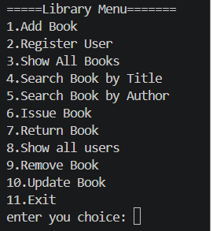
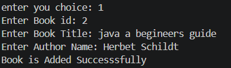
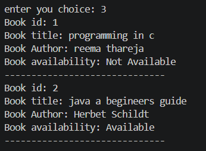
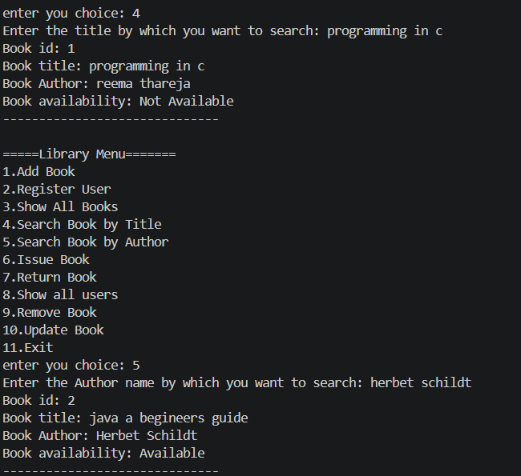
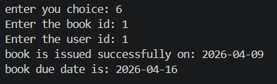
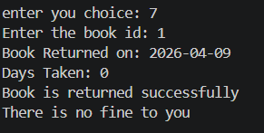

# Library-Management-System-Virtusa-Assignment-Java

## 1. Overview
This project is a simple console based **Library Management System** developed using core java technologies. The purpose of this system is to manage books,users and basic library operations like issuing and returning books. The system helps in reducing manual work by keeping track of book records and user transactions

## 2. Project Objectives
- To manage books, users, and transactions efficiently
- To track issued and returned books
- To reduce manual effort in library operations
- To provide a simple and easy-to-use system

## 3. Features
### 3.1 Book Management
- Add new books to the library
- Remove existing books
- Update book details such as title and author
- Display the list of all available books
### 3.2 User Management
- Register new users
- Prevent duplicate user IDs to maintain data integrity
- Display all registered users
### 3.3 Book Transactions
- Issue books to users
- Return issued books
- Prevent issuing books that are already issued
- Restrict issuing books to non-registered users
### 3.4 Due Date and Fine
- Automatically assigns a due date (7 days from the issue date)
- Calculates fine for late returns (₹10 per day)
- Utilizes Java `LocalDate` for accurate date handling
### 3.5 Search Functionality
- Search books by title
- Search books by author
- Supports case-insensitive and partial matching for better usability
### 3.6 Data Storage
- Stores data using text files:
  - `books.txt`
  - `users.txt`
- Automatically loads data when the program starts

## 4. Technologies Used
• Core Java 
• OOP Concepts: 
&nbsp;&nbsp;&nbsp;&nbsp;o Classes and Objects 
&nbsp;&nbsp;&nbsp;&nbsp;o Encapsulation 
• Collections: 
&nbsp;&nbsp;&nbsp;&nbsp;o ArrayList 
• File Handling: 
&nbsp;&nbsp;&nbsp;&nbsp;o BufferedReader 
&nbsp;&nbsp;&nbsp;&nbsp;o BufferedWriter 
• Java Time API: 
&nbsp;&nbsp;&nbsp;&nbsp;o LocalDate 
&nbsp;&nbsp;&nbsp;&nbsp;o ChronoUnit 

## 5. Project Structure
• model package: 
&nbsp;&nbsp;&nbsp;&nbsp;o Book.java 
&nbsp;&nbsp;&nbsp;&nbsp;o User.java 
• service package: 
&nbsp;&nbsp;&nbsp;&nbsp;o LibraryService.java 
• main package: 
&nbsp;&nbsp;&nbsp;&nbsp;o Main.java

**Note:** All these files are organized under `src/com/library/` directory, followed by their respective packages (main, model, service).

## 6. Screenshots
### 6.1 Main Menu  

### 6.2 Add Book  

### 6.3 Show All Books  

### 6.4 Search Book (By Title / Author)  

### 6.5 Issue Book  

### 6.6 Return Book (With Fine)  

## 7. How to Run

1. Open the project in any Java IDE (Eclipse, IntelliJ, or VS Code)  
2. Run the Main.java file  
3. Use the menu options displayed in the console

